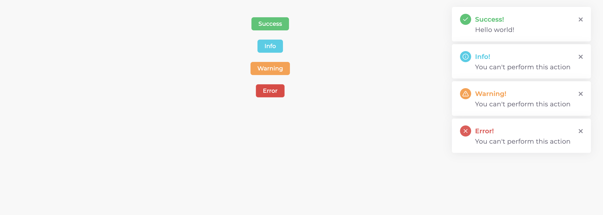

# flashtoast

<p>FlashToast is simple flash messages plugin for vue3 using same style like toast</p>

## Install
```bash
  npm install --save flashtoast
```

## Configuration
```javascript
import { flashToast } from './plugins/flashtoast/dist/flashtoast';
const app = createApp(App);
app.use(flashToast)
    ...
    .mount('#app');
```

## Declare
In root vue file. 
```vue
<FlashToast /> 

// OR with all available options

<FlashToast :position="'top-right'" :direction="'rtl'" v-zIndex:3000 v-class:any-class />
```

CSS inside your app.scss or any.
```css
@import '../js/plugins/flashtoast/dist/flashtoast.css';
```

## Usage
Use inject to make available in your component.
```javascript
import { inject } from 'vue'
export default {
    name: 'ComponentName',
    setup() {
        const toast = inject('toast');

        // Examples
        function showSuccessMessage() {
            toast.success({
                title: 'Success!',
                message: 'Hello world!',
                delay: 50000
            });
        }

        function showInfoMessage() {
            toast.info({
                title: 'Info!',
                message: 'You can\'t perform this action',
                delay: 50000
            });
        }

        function showWarningMessage() {
            toast.warning({
                title: 'Warning!',
                message: 'You can\'t perform this action',
                delay: 50000
            });
        }

        function showErrorMessage() {
            toast.error({
                title: 'Error!',
                message: 'You can\'t perform this action',
                delay: 50000
            });
        }

        return {
            showSuccessMessage,
            showInfoMessage,
            showWarningMessage,
            showErrorMessage
        }
    }
}
```
## Example

### Directive
| Name               | Type     | Default | Desciption                                                              |
| ---:               |:---:     |:---     |:---                                                                     |
| class              | String   |         | Can be use for changing the style.                                      | 
| zIndex             | String   | 3000    | You can give z-index of your choice according to your Application.      |

 :position="'top-right'" :direction="'rtl'"

### Props
|     Name       |   Type      |          Default          |              Desciption                                                                 |
|     ---:       |    :---:    |           :---:           |                :---                                                                     |
| position       |   String    | 'top-right'               | To change the position of like, top-right, bottom-right, bottom-left, top-left & center`|
| direction      |   String    | 'ltr'                     | Change direction according to the language of application, possible options ltr & rtl   |

### License
Flashtoast is open-sourced software licensed under the [MIT license](http://opensource.org/licenses/MIT).
